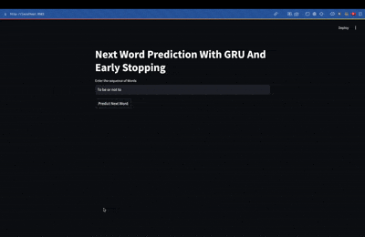

# Next Word Prediction Using GRU Neural Network

This project implements a next word prediction model using a Gated Recurrent Unit (GRU) neural network, trained on Shakespeare's "Hamlet". The model can predict the next word in a sequence based on the input text, demonstrating the application of deep learning in natural language processing.

## 🎥 Demo



## Features

- Text preprocessing and tokenization using NLTK and Keras
- GRU-based neural network architecture with embedding layer
- Early stopping mechanism to prevent overfitting
- Interactive Streamlit web interface for real-time predictions
- Trained on Shakespeare's "Hamlet" for literary text prediction
- Model evaluation and performance metrics tracking


## Installation

1. Clone the repository:
```bash
git clone https://github.com/EshantDazz/Predicting-the-next-word-in-trained-on-Shakespeare-s-Hamlet-using-GRU-or-LSTM.git
```

2. Create a virtual environment (recommended):
```bash
python -m venv venv
source venv/bin/activate  # On Windows, use: venv\Scripts\activate
```

3. Install dependencies:
```bash
pip install -r requirements.txt
```

## Model Architecture

The neural network consists of:
- Embedding layer (100 dimensions)
- Two GRU layers (150 and 100 units respectively)
- Dropout layer (0.2) for regularization
- Dense output layer with softmax activation

The model is compiled with:
- Loss function: Categorical crossentropy
- Optimizer: Adam
- Metric: Accuracy

## Training Process

The model is trained with the following specifications:
- Early stopping with patience of 3 epochs
- Validation split: 20%
- Maximum sequence length determined by input data
- Word-level tokenization
- One-hot encoded output labels

## Usage

### Training the Model

To train the model from scratch:

```bash
python train_model.py
```

### Running the Web Application

Launch the Streamlit application:

```bash
streamlit run app.py
```

The web interface will be available at `http://localhost:8501`

### Using the Prediction Function

```python
from predict import predict_next_word

input_text = "To be or not to"
next_word = predict_next_word(model, tokenizer, input_text, max_sequence_len)
print(f"Predicted next word: {next_word}")
```

## Model Performance

The model implements early stopping to prevent overfitting and maintains balance between training and validation accuracy. The GRU architecture was chosen for its:
- Efficient training compared to LSTM
- Good performance on sequence prediction tasks
- Ability to capture long-term dependencies in text

## Dependencies

- TensorFlow 2.15.0
- Pandas
- NumPy
- Scikit-learn
- TensorBoard
- Matplotlib
- Streamlit
- SciKeras
- NLTK

## Future Improvements

- Implement beam search for better prediction quality
- Add support for multiple genres/writing styles
- Enhance the web interface with additional features
- Optimize model size for faster inference
- Add temperature parameter for controlling prediction randomness

## Contributing

Contributions are welcome! Please feel free to submit a Pull Request.

## License

This project is licensed under the MIT License - see the LICENSE file for details.

## Acknowledgments

- Text corpus: William Shakespeare's "Hamlet"
- Natural Language Toolkit (NLTK) for text processing
- Streamlit for the web interface

